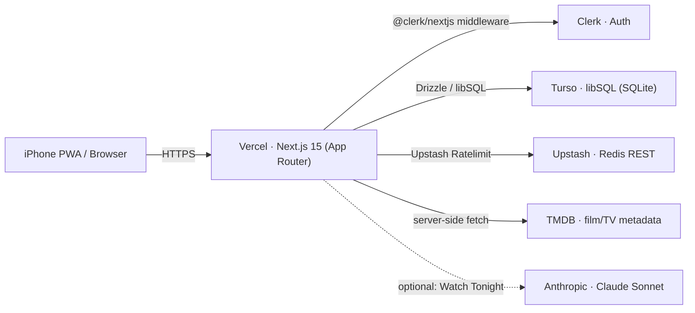

# Reel

**Your film and TV watchlist and watched log — in one cinematic, poster-forward shelf.**

Reel holds two things in one place: a **watchlist** of titles to get to, and a **watched log** with star ratings. For series, it remembers exactly where you left off (season and episode). Adding a title is near-instant because Reel pulls the poster and details from [TMDB](https://www.themoviedb.org/) for you. It installs to the iPhone home screen as a real PWA — no browser chrome, no URL bar, no pinch-zoom.

- One poster wall for everything you want to watch and everything you've watched.
- Status pipeline: Watchlist → Watching → Watched, plus On Hold and Dropped.
- One-to-five-star ratings, notes, tags, and favorites.
- Series progress saved to the episode (e.g. S2E5), bumped with one tap.
- Search, filter (type / status / tag), and sort; a ⌘K command palette.
- Light and cinematic dark themes, subtle Framer Motion throughout.
- Clerk auth so your library syncs across devices.
- Optional **Watch Tonight** AI panel that picks from your own backlog.

---

## Architecture



One Node codebase on Vercel. Server Components fetch data directly from Turso (scoped by the Clerk `userId`); Route Handlers expose a Zod-validated JSON API. Custom poster URLs are streamed through an SSRF-guarded `/api/img` proxy; TMDB posters load directly from `image.tmdb.org` via `next/image`.

---

## Setup

Prerequisites: **Node 20+** and **pnpm 11+**.

```bash
pnpm install
cp .env.example .env.local      # fill in the keys below
pnpm db:push                    # create tables in the local SQLite file
pnpm db:seed                    # ~8 demo titles across both types & all statuses
pnpm dev                        # http://localhost:3000
```

> `pnpm db:push` is interactive on first run (confirm "Yes, execute all statements").
> For migration files instead, use `pnpm db:generate` then `pnpm db:migrate`.

Local dev uses a plain SQLite file (`file:./local.db`) — no Docker, no cloud account required to start.

---

## Environment variables

Copy `.env.example` to `.env.local` and fill in:

| Variable                            | Required   | What it's for                                            | Where to get it                                               |
| ----------------------------------- | ---------- | -------------------------------------------------------- | ------------------------------------------------------------- |
| `NEXT_PUBLIC_CLERK_PUBLISHABLE_KEY` | yes        | Clerk client key                                         | [dashboard.clerk.com](https://dashboard.clerk.com) → API keys |
| `CLERK_SECRET_KEY`                  | yes        | Clerk server key                                         | same                                                          |
| `TURSO_DATABASE_URL`                | yes        | DB URL — `file:./local.db` locally, `libsql://…` in prod | [turso.tech](https://turso.tech) (`turso db create reel`)     |
| `TURSO_AUTH_TOKEN`                  | prod only  | Auth token for hosted Turso (empty locally)              | `turso db tokens create reel`                                 |
| `TMDB_API_KEY`                      | for search | Film/TV metadata + posters                               | **Free** — see below                                          |
| `UPSTASH_REDIS_REST_URL`            | prod       | Rate limiting (disabled if empty)                        | [console.upstash.com](https://console.upstash.com)            |
| `UPSTASH_REDIS_REST_TOKEN`          | prod       | Rate limiting                                            | same                                                          |
| `ANTHROPIC_API_KEY`                 | optional   | Watch Tonight AI panel only                              | [console.anthropic.com](https://console.anthropic.com)        |

**Get a free TMDB API key:** create an account at [themoviedb.org](https://www.themoviedb.org/), go to **Settings → API**, request a developer key (instant, free), and paste either the **v3 API key** or the **v4 Read Access Token** into `TMDB_API_KEY` — Reel auto-detects which you provided. The key is server-side only and never reaches the browser.

---

## Scripts

| Script             | What it does                                             |
| ------------------ | -------------------------------------------------------- |
| `pnpm dev`         | Start the dev server                                     |
| `pnpm build`       | Production build                                         |
| `pnpm start`       | Serve the production build                               |
| `pnpm test`        | Unit + integration tests (Vitest)                        |
| `pnpm test:e2e`    | Playwright flows (needs a base URL + Clerk test user)    |
| `pnpm lint`        | ESLint                                                   |
| `pnpm typecheck`   | `tsc --noEmit` (strict)                                  |
| `pnpm format`      | Prettier (with Tailwind class sorting)                   |
| `pnpm db:push`     | Push the schema to the DB (dev)                          |
| `pnpm db:generate` | Generate SQL migrations                                  |
| `pnpm db:migrate`  | Apply migrations (CI / prod build step)                  |
| `pnpm db:seed`     | Seed demo data                                           |
| `pnpm icons`       | Regenerate the icon set from `scripts/generate-icons.ts` |

---

## Install to the iPhone home screen

Reel is a real installable PWA. On a deployed (HTTPS) URL:

1. Open the site in **Safari** on iPhone.
2. Tap **Share** → **Add to Home Screen** → **Add**.
3. Launch from the new icon: it opens **full-screen with no URL bar**, respects the notch/home-indicator safe areas, and **pinch-zoom is disabled** so it feels like a native app.

On **Android Chrome**, an **Install** prompt appears (the service worker caches the app shell); the installed app launches standalone.

> Screenshots: see `docs/screenshots/` (add `install-1.png` … `install-3.png` for the Share-sheet steps).

Because zoom is off, base text stays ≥ 16px and contrast stays ≥ 4.5:1, so the app is fully usable without it.

---

## Testing

- **Unit (Vitest):** Zod schemas, the initials-tile color hash, the SSRF guard, stats aggregation, the search/filter/sort query builder, TMDB mapping. ≥ 80% coverage on `lib/`.
- **Integration (Vitest, in-memory libSQL — no Docker):** route handlers including the **cross-user isolation** test (user A cannot read/patch/delete user B's titles) and TMDB-route handling (no-results + network-failure).
- **E2E (Playwright):** three flows against a deployed preview — add a film via TMDB search, track a series and bump S2E5 → S2E6, and rate a watched film four stars and see the dashboard update. Auth uses [`@clerk/testing`](https://clerk.com/docs/testing/playwright) with a password-enabled test user (`E2E_CLERK_USER_USERNAME` / `E2E_CLERK_USER_PASSWORD`).

```bash
pnpm test                                   # unit + integration
PLAYWRIGHT_BASE_URL=https://<preview> pnpm test:e2e
```

---

## Deploy (Vercel + Turso)

1. `turso db create reel` and create an auth token.
2. In Vercel, set all env vars (Clerk, Turso, Upstash, TMDB; Anthropic only if keeping Watch Tonight).
3. Add `pnpm db:migrate` as a build step (or run it once against prod).
4. Push to `main`. Verify on iPhone: install flow, zoom disabled, posters load, dashboard works.

---

## Removing the optional AI panel

To ship with **no model at all**, delete `app/api/recommend/`, `lib/recommend.ts`, `components/watch-tonight/`, the Watch Tonight buttons in `components/app-chrome.tsx`, and the `ANTHROPIC_API_KEY` env var — everything else works unchanged.
